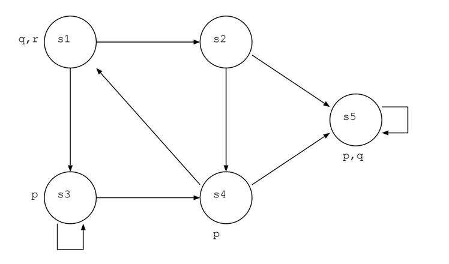

## log-prog-2019
This is a series of python scripts that implement a few logic formula verifiers. At the moment, these are: [simple propositional logic](#logprog_basic), [modal logic](#logprog_modal), and [multi-agent modal logic](#logprog_multiagent) (which has a [public announcement extension](#logprog_announcements)).

#### General Guidelines
Run with python3! It is in your hands to make sure your formulae are well formed. The program has basic error handling, but it still has ways to go until it is perfect. Make sure parenthesis are balanced and not empty, and there is no overlap between variable names and operator tokens. There's no sanity checking on the models whatsoever.

Each implementation has a `solve()` method, that takes the formula (`phi`) for verification and data structures that represent the related models. Find below short descriptions, operator lists and examples (refer to [logprog_tester.py](logprog_tester.py) for more).

A few different tokens are used for each operators, you can use them interchangeably and mix and match.

### logprog_basic
Basic propositional logic, exposed here mostly for educational purposes. `solve( phi: str, V: dict ) -> bool` takes a dictionary of literals and uses it to verify the formula.

#### Example
```python
V = { 'A': True, 'B': False, 'C': False, 'D': True }

solve("A AND B",V) # True
solve("A OR B",V) # True
solve("NOT A",V) # False
solve("(A OR B) AND (C OR D)",V) # True
solve("(A->B)->(C->D)",V) # True
```

#### Unary operators 
[`NOT`|`!`|`¬`]
#### Binary operators 
[`AND`|`&`|`∧`], [`OR`|`|`|`∨`], and [`IMPLIES`|`->`|`→`]

## modal_implementation

### Basic usage
Just use the function `solve( phi, W, R, V, w )`. The output will be `bool`. 

#### Format
Provide a the formula as a `str` making sure no variable names will coincide with operator names. Ensure parens are be balanced, and not empty.
The model is expressed by:
- A `dict` where each literal is associated to a `list` of states where it is true; 
- a `list` of states and
- another `dict` with `lists` representing each state and the states they connect to.

#### Example
Let us use this example model:



Which can be expressed by this code:
```python
V = { 
	'p': [ 's3', 's4', 's5' ], 
	'q': [ 's1', 's5' ], 
	'r': [ 's1' ] 
}
W = [ 's1', 's2', 's3', 's4', 's5'  ]
R = { 
	's1' : [ 's2', 's3' ], 
	's2' : [ 's5', 's4' ], 
	's3' : [ 's3', 's4' ], 
	's4' : [ 's1', 's5' ], 
	's5' : [ 's5' ] 
}

solve( "q AND r", W, R, V, "s1" ) # True
solve( "q OR r", W, R, V, "s3" ) # False
solve( "POSSIBLY p", W, R, V, "s3" ) # True
solve( "NECESSARILY NOT r", W, R, V, "s4" ) # False
```

### Operators
Listed in priority order. The parens `(` and `)` can be used to specify order of resolution.
#### Unary operators 
`NOT`, `POSSIBLY` and `NECESSARILY` or

`!`, `<>` and `[]` or

`¬`, `◇` and `□`
#### Binary operators 
`AND`, `OR` and `IMPLIES` or

`&`, `|` and `->` or

`∧`, `∨` and `→`

## Useful links
[List of logic symbols](https://en.wikipedia.org/wiki/List_of_logic_symbols) on Wikipedia

[Modal Logic Playground](https://rkirsling.github.io/modallogic/) by Ross Kirsling ~~who stole the idea of doing it long before I had it~~
